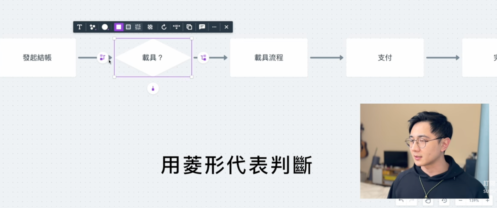
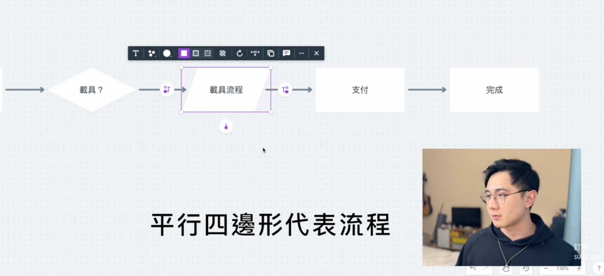
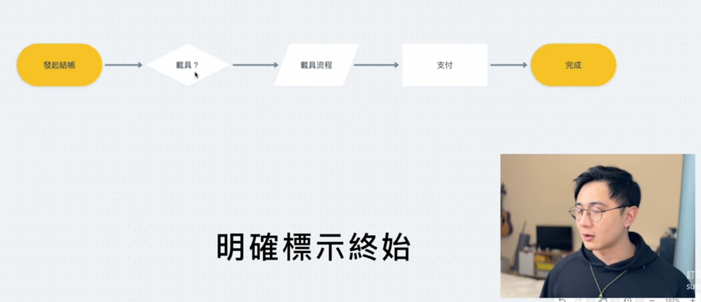
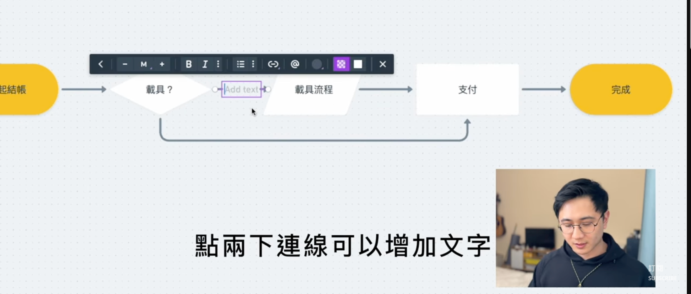
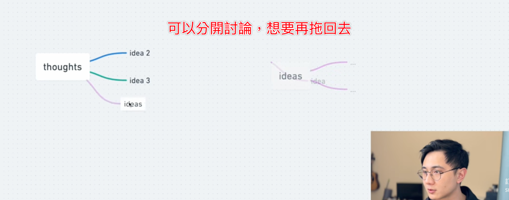
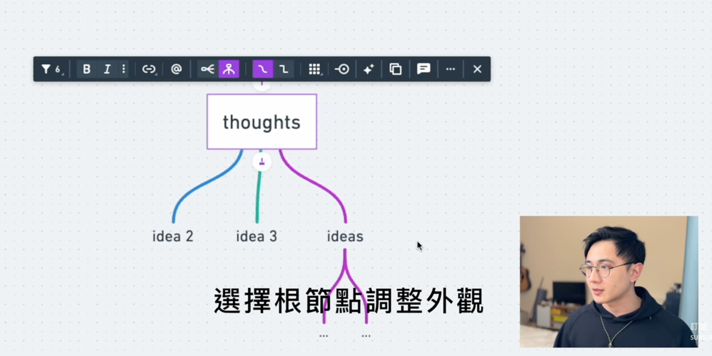
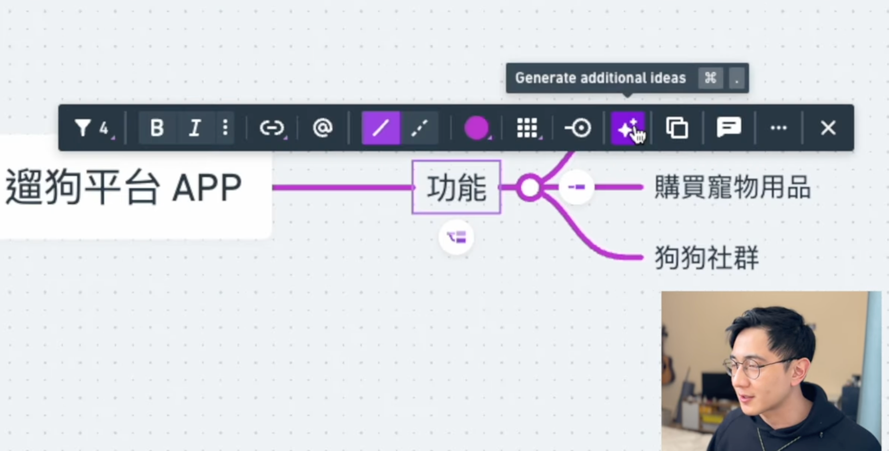
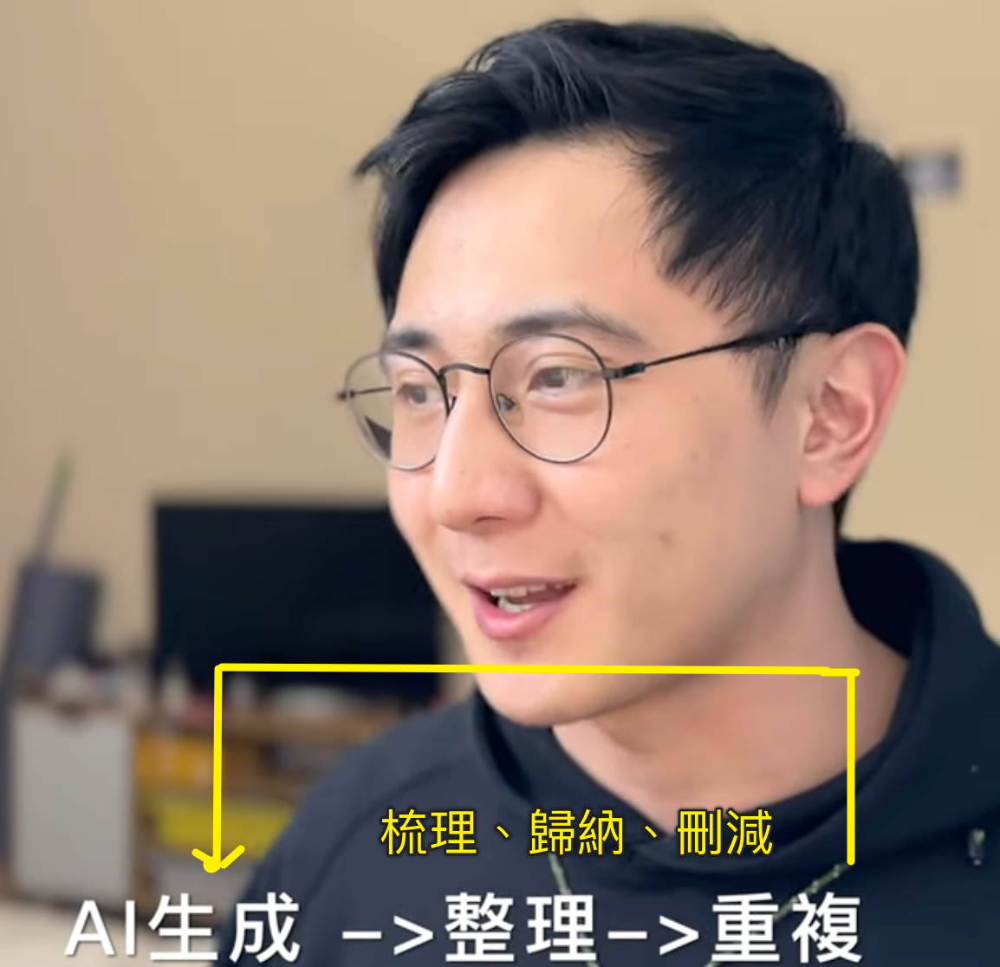

# Whimsical 使用說明

[Whimsical](https://iancheng0323.medium.com/%E5%BF%83%E6%99%BA%E5%9C%96-%E6%B5%81%E7%A8%8B%E5%9C%96-%E4%BE%BF%E5%88%A9%E8%B2%BC-all-in-one-%E7%9A%84%E8%B6%85%E5%A5%BD%E7%94%A8%E5%B7%A5%E5%85%B7-whimsical-56a2491db77c) 涵蓋流程圖（Flowchart）與心智圖（Mind Map）的用法。

## 流程圖（Flowchart）

- **菱形代表判斷** — 菱形（diamond）代表「判斷／分支」節點，例如「載具？」這種需要決定走向的步驟。
  
- **平行四邊形代表流程** — 平行四邊形（parallelogram）代表「流程／子流程」節點，例如「載具流程」「支付」這類實際執行的步驟。
  
- **明確標示起終點** — 用膠囊形（圓角矩形，範例中為黃色）明確標示流程的「起點」與「終點」，例如「發起結帳」「完成」，讓整張圖一眼看出頭尾。
  
- **雙擊連線新增文字** — 在兩個節點之間的連線上「雙擊」，可以直接在線上加註文字（例如判斷分支的條件說明），不需要額外拉文字框。
  

### 小結：畫流程圖的形狀慣例
| 形狀 | 意義 |
|---|---|
| 圓角矩形 | 起點、終點 |
| 矩形 | 一般步驟 |
| 平行四邊形 | 流程／子流程 |
| 菱形 | 判斷／分支 |

## 心智圖（Mind Map）

- **分支可收合** — 心智圖的分支可以「收合」成一個節點，隱藏細節方便討論
  
- **調整外觀** — 點選「根節點」（例如 thoughts）統一調整心智圖的外觀樣式（線條顏色、粗細等）。
  
- **AI 生成更多想法** — 選取某個節點後，工具列有 **Generate additional ideas**（快捷鍵 `⌘ .`）功能，可以讓 AI 根據節點自動生成延伸的想法
  

### 發想的工作流
  
  1. **發想** —快速透過介面釐清初始想法
  2. **整理** — 梳理、歸納、刪減，篩掉不合適的分支
  3. **重複** — 針對留下的節點再次生成，反覆迭代

## 快速上手建議
1. 先確定要畫的是「流程圖」還是「心智圖」：
  - 流程圖適合表達有先後順序、有判斷分支的流程
  - 心智圖適合發散式的腦力激盪。
2. 畫流程圖時，善用起訖、判斷、流程三種形狀的慣例

